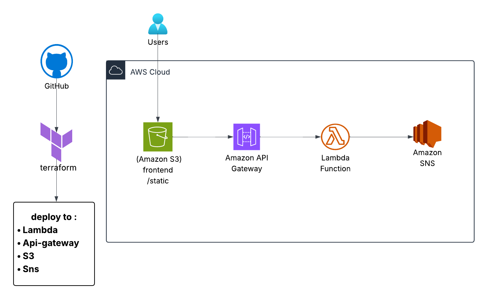
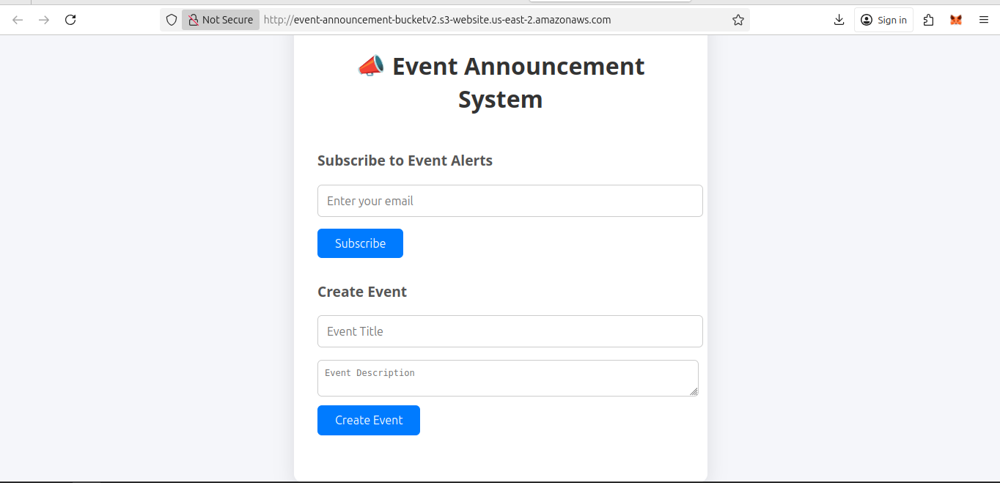

A fully serverless announcement subscription system built with **AWS Lambda**, **API Gateway**, **SNS**, and **S3**.

Users can **subscribe to event announcements by email**, and automatically receive notifications when new events are published.

This project demonstrates the use of AWS-managed services to build a scalable, event-driven backend system — perfect for newsletters, community updates, or school announcements.

---

## 🧠 Features

- ✅ Email subscription using AWS SNS
- ✅ API Gateway + Lambda function for backend logic
- ✅ Static frontend hosted on S3
- ✅ Secure, fast, and fully serverless
- ✅ Easily extensible for admin-based event publishing

---

## 🛠 Tech Stack

| Layer         | Service Used         |
|---------------|----------------------|
| Frontend      | HTML + CSS (Hosted on S3) |
| Backend Logic | AWS Lambda (Node.js) |
| API Interface | AWS API Gateway      |
| Email System  | AWS SNS              |
| Storage       | AWS S3               |

## 🚀 How It Works

1. User visits the frontend page (hosted on S3)
2. Enters email and submits the form
3. Form sends a request to the API Gateway
4. API Gateway triggers the Lambda function
5. Lambda subscribes the email to an SNS topic
6. SNS confirms subscription and manages future notifications

---

## 🧪 Local Setup

 to test the Lambda function locally:

git clone https://github.com/kelvin005/Event-Announcement-System
cd Event-Announcement-System
terraform apply -auto-approve
You'll need to configure AWS credentials via aws configure or use a .env with your AWS_ACCESS_KEY_ID and AWS_SECRET_ACCESS_KEY.

🌍 Live Demo 

📌 AWS Services in Use

    Amazon S3 – hosts the frontend static website

    AWS Lambda – handles email subscription logic

    Amazon API Gateway – exposes a REST endpoint

    Amazon SNS – manages email list and sends announcements

🤝 Contributing

This is a personal project for my portfolio, but feel free to fork it or give feedback via Issues .
📄 License

MIT © Kelvin Sunday